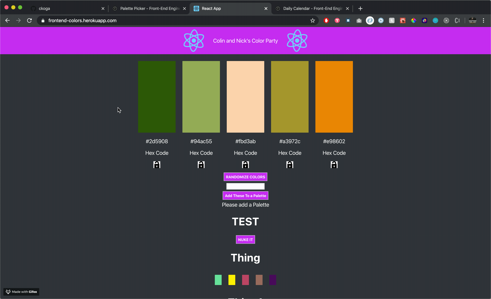
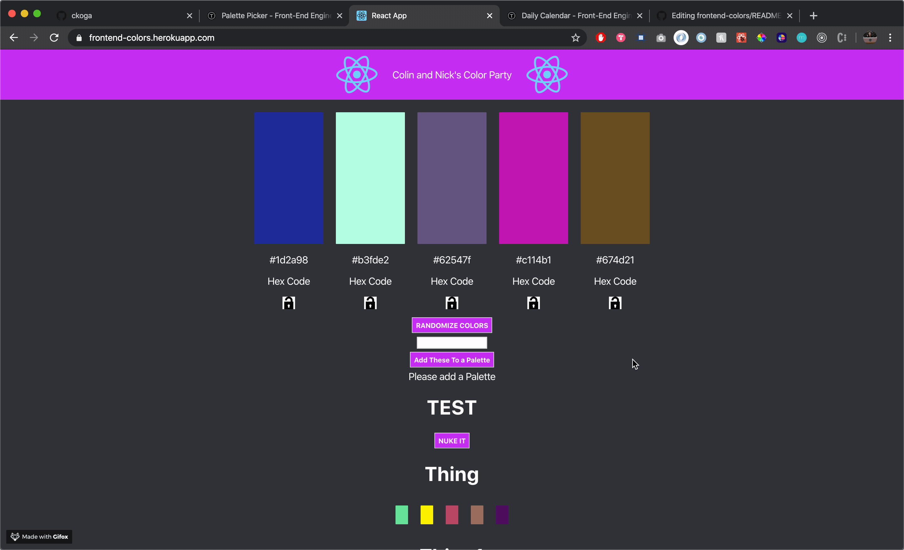
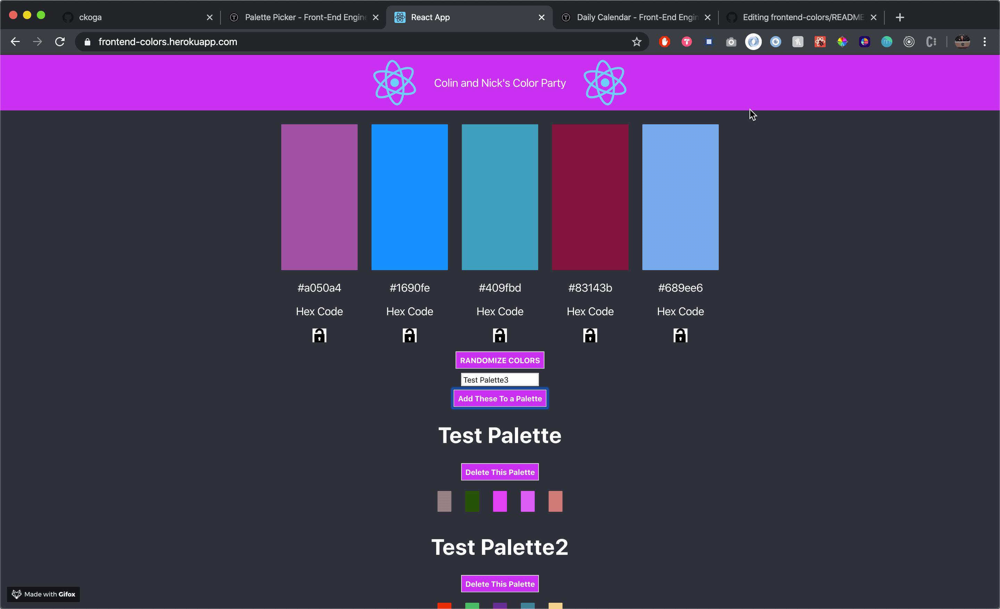
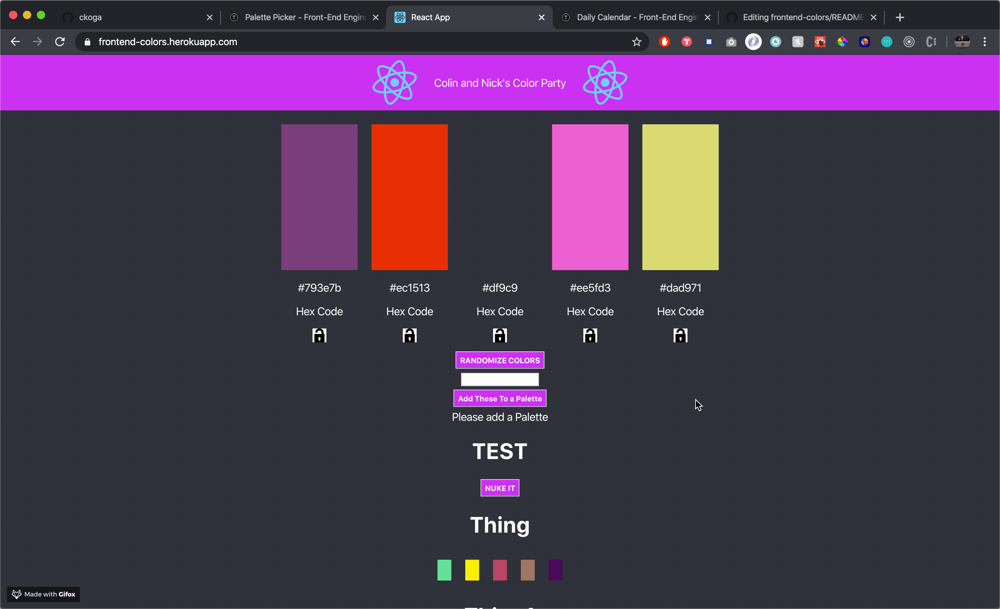
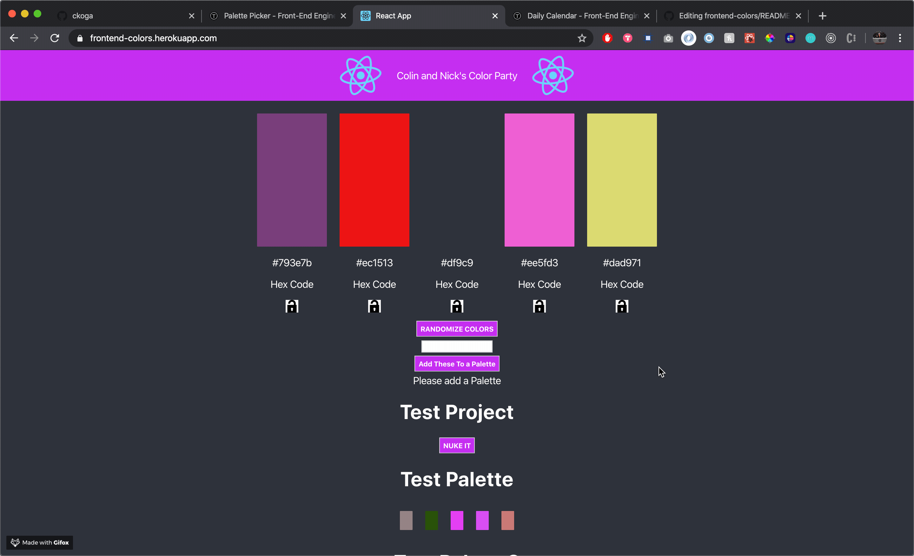

# Front-End Colors!

## Welcome to Nick and Colin's 'Color Party'

Have you ever needed to randomly create colors and put them in 'Projects' but only 3 Color Palettes per Project? Look no further!

## Setup

Feel free to pull down this repo, run 'npm install'

To verify that it is setup correctly, run `npm start` in your terminal. Go to `http://localhost:3000/`. Enter `control + c` in your terminal to stop the server at any time.

If you want, feel free to run `npm test` to check out our coverage and make sure everything is passing!

In addition, this application is deployed! Here's the link:
[Front-End on Heroku](https://frontend-colors.herokuapp.com/)

Also, here's our deployed backend README: 
[Backend README](https://github.com/ckoga/backend-colors)

### Wins

This project had a lot of ups and downs. I would say some of the best things that were accomplished: 
1. Implementing testing with Hooks as well as for async functions such as fetch. We learned way too late that it's easier to test useEffect and some of the other nuances of Hooks with the React Testing Library, but we just used Jest and Enzyme.
1. Implementation of Hooks and a fully functional backend was really fun to get the full picture of how to create something from start to finish and deploy it.
1. This was our first backend/frontend combo that is deployed to heroku!

### Challenges

Some of the bigger challenges of this project:
1. Testing hooks was one of the biggest things to figure out how to navigate on the frontend side. 
1. Once we started making decisions on the backend, it pigeon-holed where we could go a little bit on the frontend. I wish we would have thought through both more thoroughly before jumping in too much on one side or the other.

### Future Iterations

If given more time:
1. We would create a way to delete a palette within an already created project. This is not necessarily a part of our MVP and would have done that if we had more time
1. We would have used all of our endpoints, specifically our PATCH methods on the backend.
1. We would create a way to edit a palette within a project.

### ScreenShots
#### ColorPicker and Lock

#### Lock and Randomize

#### Add Palette

#### Add Project

#### Delete Project

#### Delete Palette

## Collaborators

[Nick Nist](https://github.com/nicknist) | [Colin Koga](https://github.com/ckoga)
